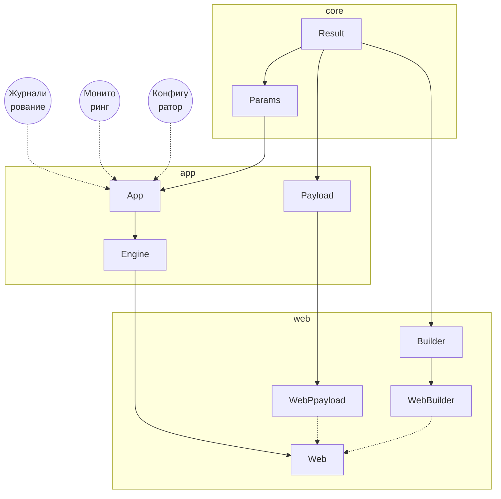

# web
1. Библиотеки вебсервера.
2. Fork https://gitlab.com/catlair/pusa/-/tree/main/php/web


# Репозиторий

1. https://github.com/johnthesmith/catlair-php-lib-web


# Схема




# URL

1. http://localhost/path-to-route/method/key/value?key=value
    1. `localhost` — сервер
    0. `path-to-route` — имя роутера → файл path/to/route.yaml
    0. `method` — опциональный вызываемый метод класса из либы (умолчательный, 
    если не указан), умолчальный `index`
    0. `key`/`value` — пары параметров пути (альтернативный способ передачи 
    параметров)
    0. `?key=value` — параметры запроса (GET-параметры)


# Суть

1. Роуты стабильны по имени и указывают на либу с классом-реализацией множества 
методов.
2. Для кастомизации создаётся новый роут с тем же именем, указывающий на наследника 
либы, где переопределён нужный метод.


# Структура

1. Роут path-to-route → файл path/to/route.yaml
2. В роуте:
```
library: путь_к_либе
class: Класс_либы
caller: api (или другое)
```
3. Либа — класс с множеством методов (дефолтные), минимально `index` метод.


# Действия для кастомного переопределения

1. Создать класс-наследник дефолтной либы в проекте.
0. В классе переопределить только нужные методы.
0. Создать или изменить роут с тем же именем, указав в library путь к новой 
либе, class — новый класс.
0. При запросе роут загрузит новую либу с кастомным методом, остальные методы 
останутся дефолтными по наследству.
