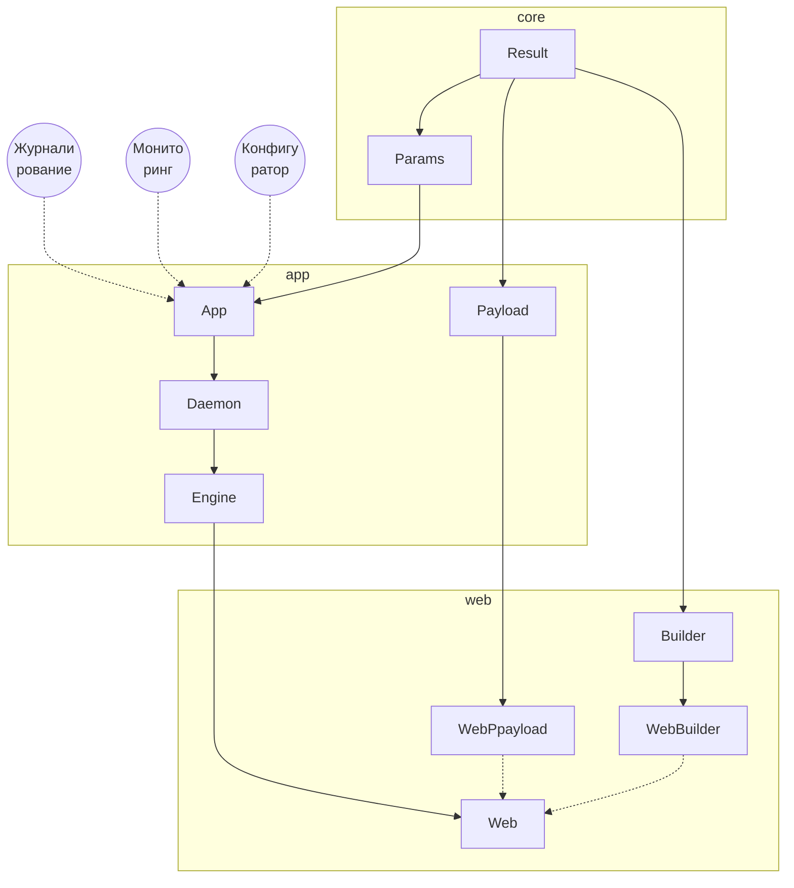

# web

1. Библиотеки вебсервера.
2. Fork https://gitlab.com/catlair/pusa/-/tree/main/php/web

# Схема

```mermaid
flowchart
    subgraph core
        Result
        Params       
    end
    subgraph app
        Payload
        Daemon
        App
        Engine
    end
    subgraph web
        Web
        Builder
        WebPpayload
        WebBuilder
    end
    Log((Журнали<br>рование)) -.-> App
    Mon((Монито<br>ринг)) -.-> App
    Con((Конфигу<br>ратор)) -.-> App
    Params --> App
    App --> Daemon
    Daemon --> Engine
    Result --> Payload
    Result --> Params
    Engine --> Web
    Payload -----> WebPpayload
    WebPpayload -.-> Web
    Result ----> Builder    
    Builder --> WebBuilder
    WebBuilder -.-> Web
```
